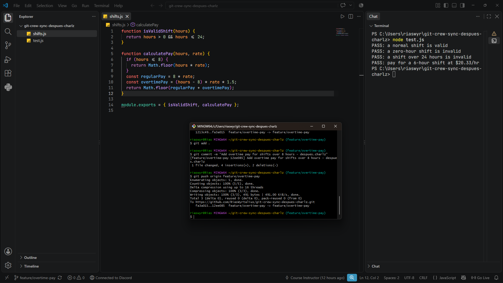
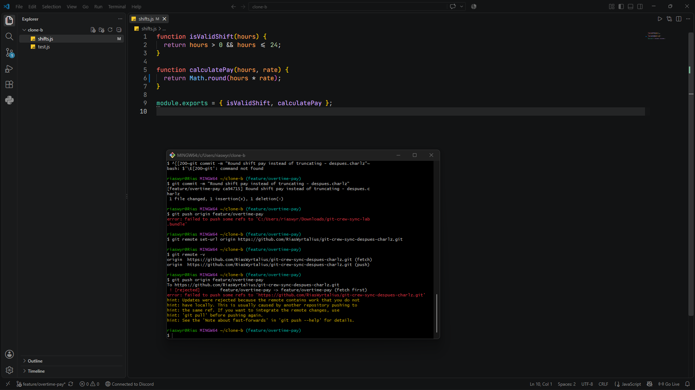
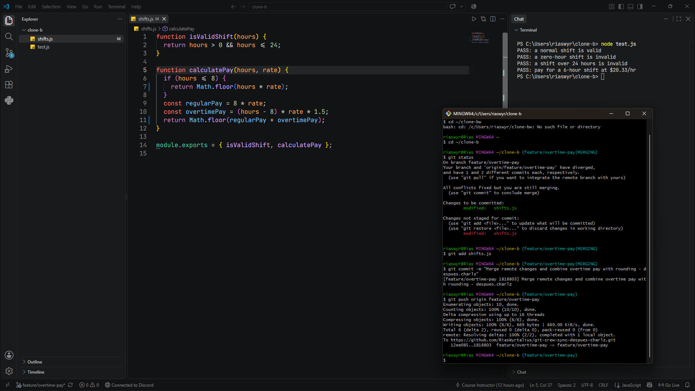
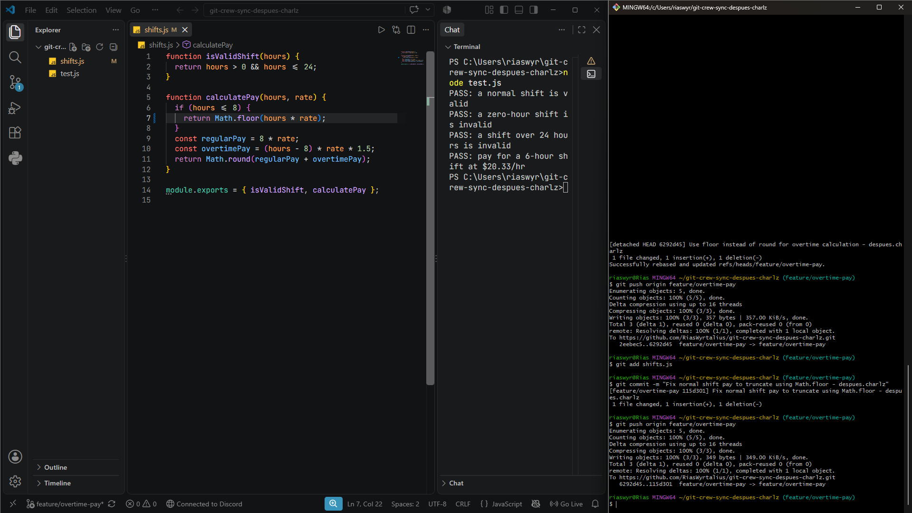
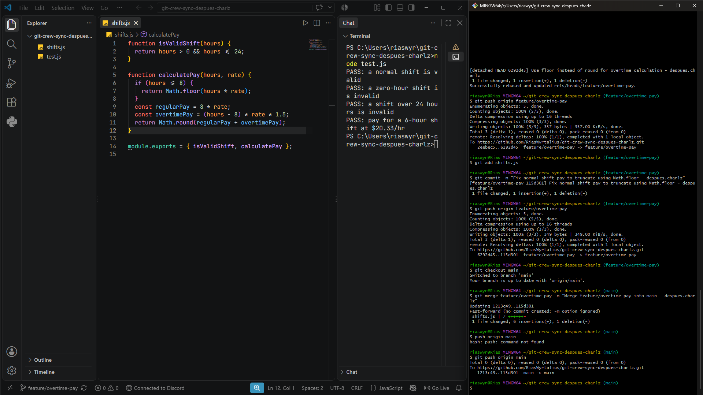
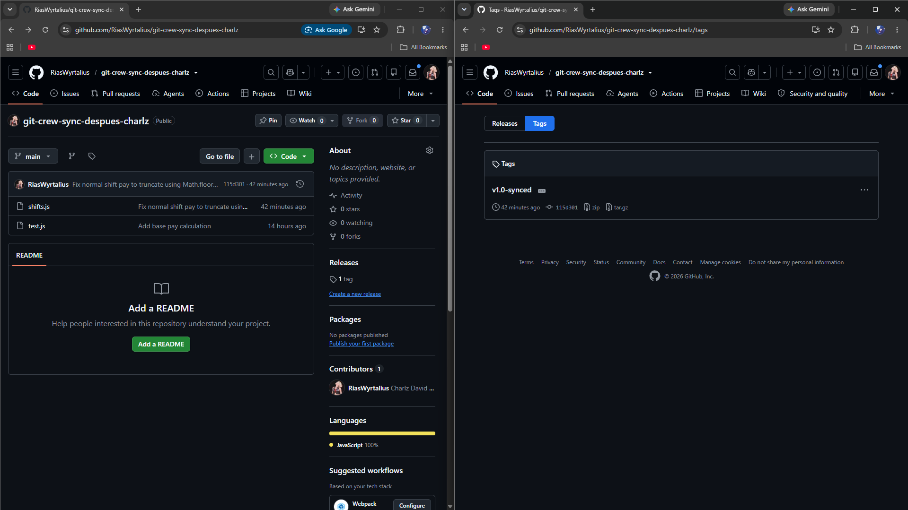

# Workflow Report: Crew Sync Lab

## Task Screenshots

### Task 1

### Task 2

### Task 3

### Task 4

### Task 5

### Task 6

---

## Written Responses

### 1. What did the rejected push error message tell you, and why did it happen?
The error message (`! [rejected] - non-fast-forward`) indicated that the remote branch contained commits that were not present in the local copy. Git rejected the push to prevent silently overwriting or destroying work that another collaborator had already pushed to the shared branch. It happens whenever the remote tip has diverged from your local base commit.

### 2. What's the actual difference between how you resolved Task 3 (merge) vs Task 4 (rebase)?
In Task 3, `git merge` created a distinct merge commit with two parent commits, preserving the exact non-linear timeline and history of how both branches developed simultaneously. In Task 4, `git rebase` rewrote commit history by temporarily lifting the local commit, updating the branch base to match the remote tip, and replaying the local commit on top of it. This created a completely linear history without a merge commit.

### 3. What one habit would have avoided both rejected pushes in this lab?
Running `git pull` (or `git fetch` followed by inspecting incoming changes) immediately before beginning new work and right before attempting to push would have synchronized the local branch with the remote state, avoiding push rejections.

### 4. Which approach - merge or rebase - would you default to on a shared team branch, and why?
On a shared team branch, **merge** is the safer and standard default. Rebasing rewrites commit hashes; if done on commits that other teammates have already pulled or based work upon, it causes divergent histories and forces complex manual recoveries. Merging preserves true chronological history and is non-destructive to collaborators' tracking references.